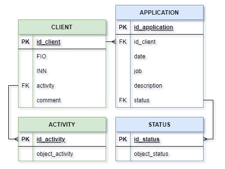

# WINDOWS APPLICATION 

*Приложение для Windows с графическим интерфейсом с использованием технологии WPF на платформе Net Framework 4.7.2.  и языке C#*

В окне приложения отображаются 2 вкладки:
- Клиенты
- Заявки

На первой вкладке:
- Верхняя часть содержит 2 таблицы:
    - "Cписок клиентов":
        -  наименование
        -  инн
        -  сфера деятельности
        -  количество заявок
        -  дата последней заявки
    - "Cписок заявок":
        -  дата заявки
        -  наименование работ
        -  описание работ
        -  статус (новая, в работе, выполнена)
- Нижняя часть cодержит блок с текстом "Примечание"

На второй вкладке таблица "Список всех заявок".

## ФУНКЦИОНАЛЬНОСТЬ
- В таблице "Список клиентов": 
    - клиенты отображаются в алфавитном порядке;
    - при выборе клиента *(с помощью мыши или клавиатуры)* в таблице "Список заявок" отображаются заявки, принадлежащие выбранному клиенту, а в блоке "Примечание" - дополнительная информация по выбранному клиенту.

- В таблице "Список всех заявок":
    - заявки по всем клиентам отсортированны по убыванию даты создания.
    - добавлен фильтр по ФИО клиента в виде выпадающего списка для отображения заявок только выбранного клиента. 
    - реализован функционал изменения статуса заявки.

- Во всех таблицах реализована:
    - сортировка строк по выбранной колонке *(кликом мыши на заголовке столбца)*;
    - добавление, изменение и удаление клиентов *(кликом правой кнопки мыши на клиента)*;
    - добавление и удаление заявки *(кликом правой кнопки мыши на заявку)*.

Операции по работе с клиентами и заявками происходят в отдельных всплывающих окнах.

## Структура базы данных, в которой храняться данные для приложения:

Параметры подключения к серверу БД считываются из конфигурационного файла *(config.txt)*.

Для построения БД использовалась SQLiteStudio 3.4.3
